<!--
Background images:
- https://github.com/hakimel/reveal.js/#slide-backgrounds
- cover: ensure background is covered (image may be cropped)
- contain: scale to fit
-->

# OMERO and the<br/>Image Data Resource:
## Supporting open science in Dundee and around the world
<div style="text-align: right; margin-left: 40%;">
Simon Li<br/>
Open Microscopy Environment
</div>

---

## Open science

Who thinks it's a good idea?

> More than 70% of researchers have tried and failed to reproduce another scientist's experiments, and more than half have failed to reproduce their own experiments.
<!-- .element class="fragment" -->
http://www.nature.com/news/1-500-scientists-lift-the-lid-on-reproducibility-1.19970 <!-- .element class="caption" -->

---

## Why is the IDR needed?
Bioinformatics databases are taken for granted in the life sciences
<div class="flexcontainer">
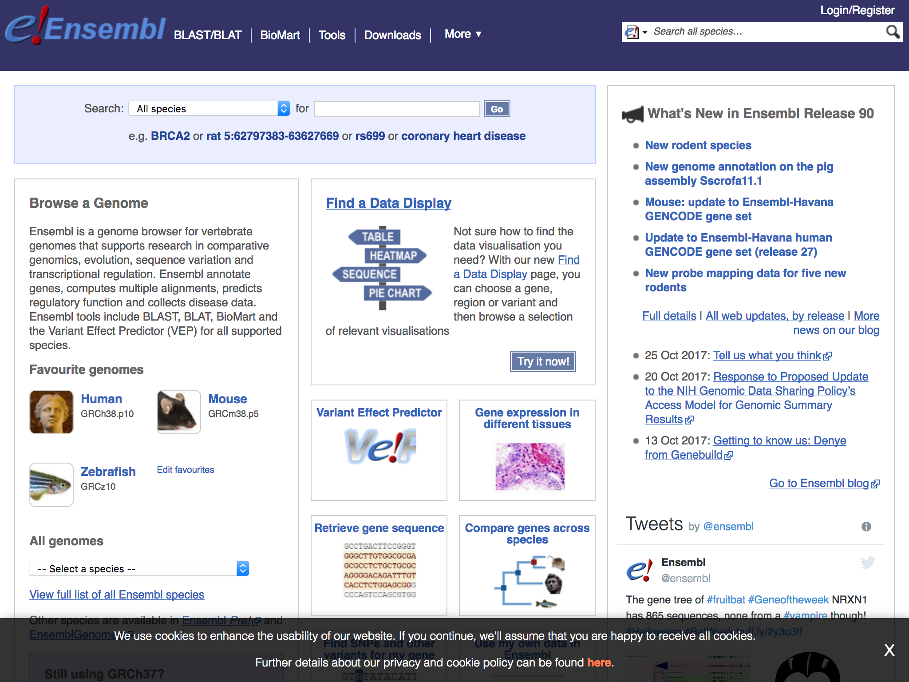 <!-- .element class="flex1" -->
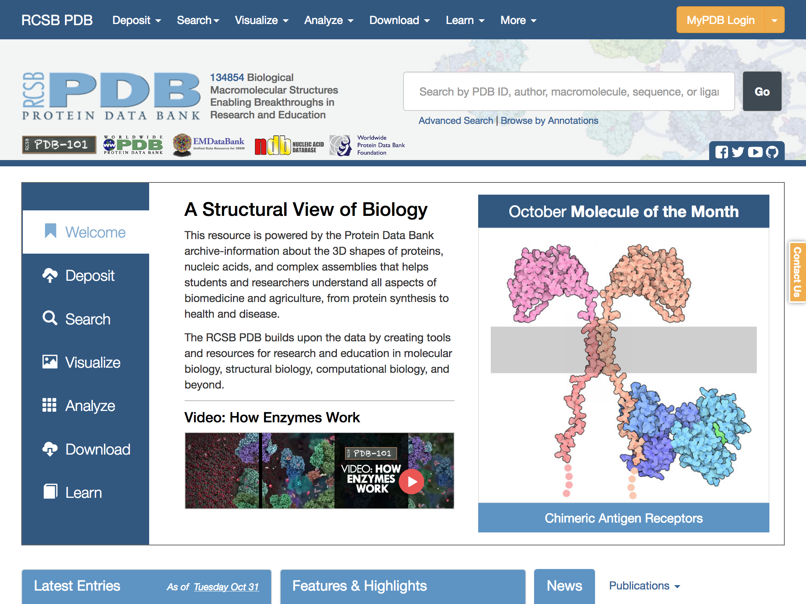 <!-- .element class="flex1" -->
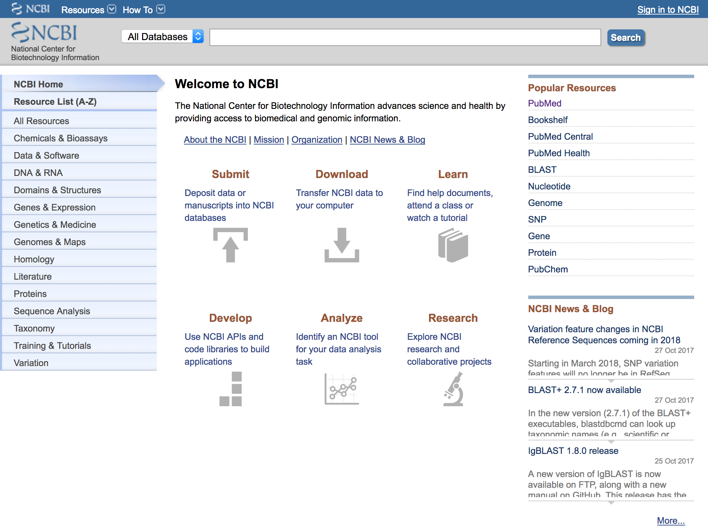 <!-- .element class="flex1" -->
</div>

---

## What about imaging?
Image databases have lagged behind though. There are several application-specific repositories:
<div class="flexcontainer">
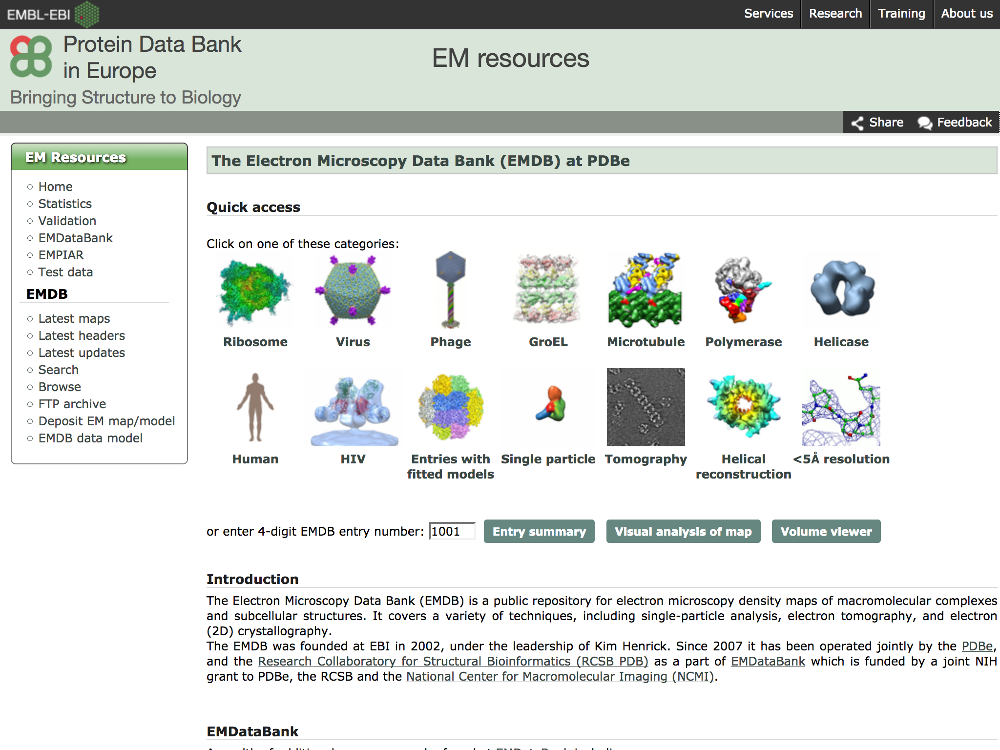 <!-- .element class="flex1" -->
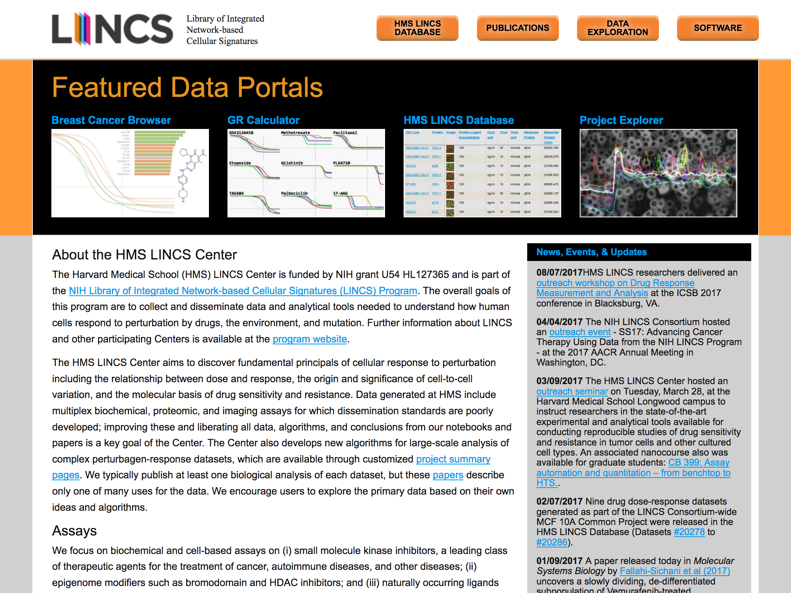 <!-- .element class="flex1" -->
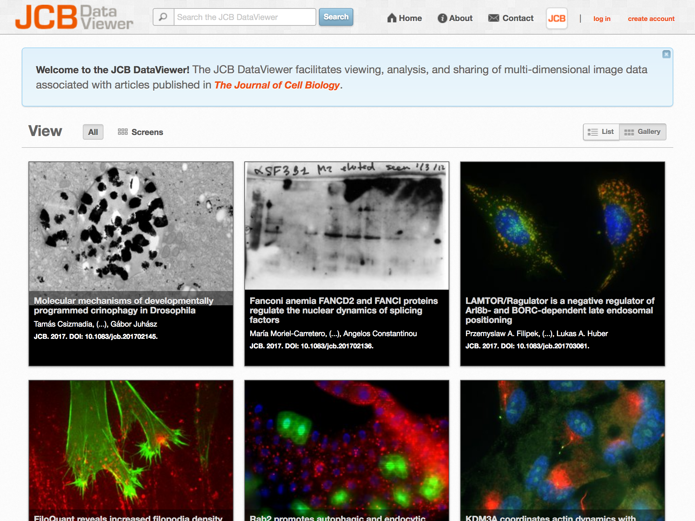 <!-- .element class="flex1" -->
</div>

---

## What's the difficulty?

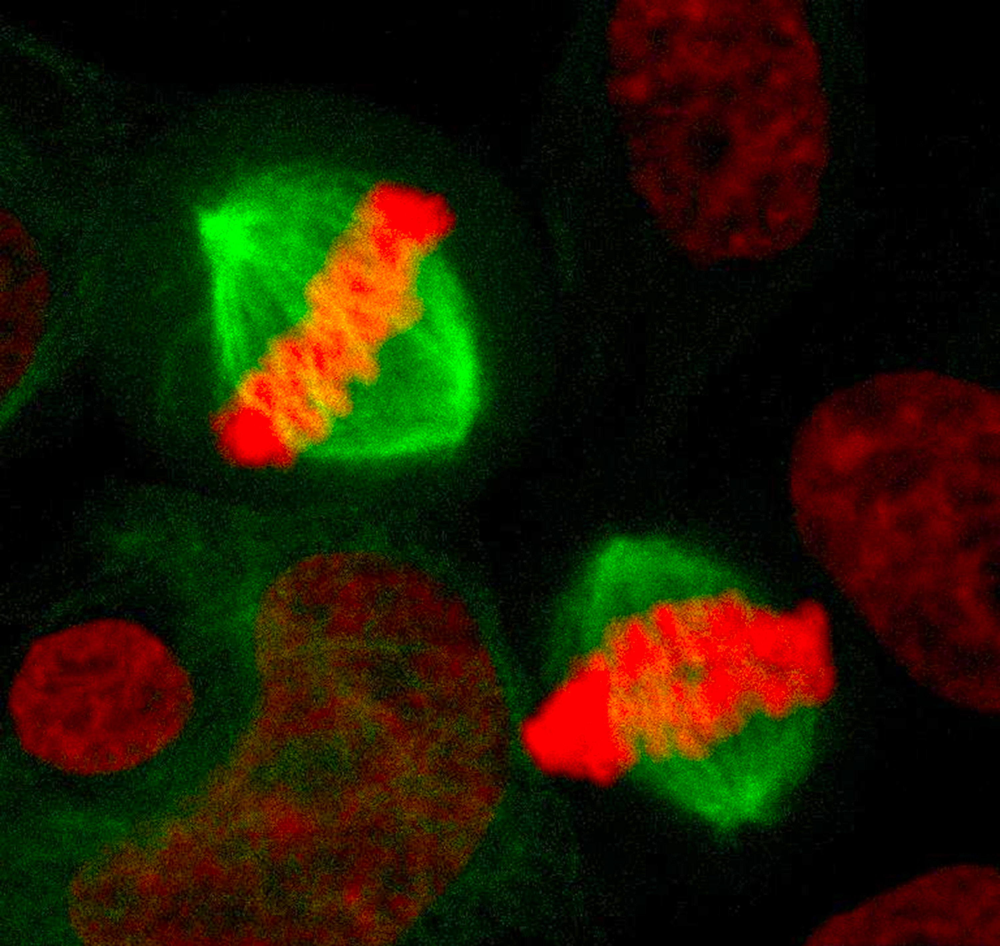 <!-- .element height="50%" width="50%" -->
<!--
https://celldivisionlab.files.wordpress.com/2015/06/single-frame.jpg
TODO: Find an IDR image.
-->

----

## What's the difficulty?

```text
>sp|Q96GD4|AURKB_HUMAN Aurora kinase B OS=Homo sapiens GN=AURKB PE=1 SV=3
```
<!-- .element: class="fragment" data-fragment-index="1" -->
```text
MAQKENSYPWPYGRQTAPSGLSTLPQRVLRKEPVTPSALV
LMSRSNVQPTAAPGQKVMENSSGTPDILTRHFTIDDFEIG
RPLGKGKFGNVYLAREKKSHFIVALKVLFKSQIEKEGVEH
QLRREIEIQAHLHHPNILRLYNYFYDRRRIYLILEYAPRG
ELYKELQKSCTFDEQRTATIMEELADALMYCHGKKVIHRD
IKPENLLLGLKGELKIADFGWSVHAPSLRRKTMCGTLDYL
PPEMIEGRMHNEKVDLWCIGVLCYELLVGNPPFESASHNE
TYRRIVKVDLKFPASVPMGAQDLISKLLRHNPSERLPLAQ
VSAHPWVRANSRRVLPPSALQSVA
```

---

## What's the difficulty?

- Image data is extremely difficult to automatically annotate
  - There are 100s of different file formats
- Genomics/proteomics data is often text-based
  - annotations are mandatory for understanding

---

## What is the Image Data Resource?

### https://idr.openmicroscopy.org

----

<!-- .slide: data-background-image="images/idr-about.png" data-background-size="cover" data-background-position="top" -->

----

## A repository for reference datasets and images that

> constitute valuable resources for a broader community of users that will often be accessed as a reference or that will be recomputed to extract additional information and knowledge

[Euro-BioImaging - ELIXIR Image Data Strategy](http://www.eurobioimaging.eu/sites/default/files/Euro-BioImaging_Elixir_Image_Data_Strategy_0.pdf) <!-- .element class="caption" -->

---

## The IDR today:

- 30 data submissions
- 1 million experiments
- 2.7 million images
- 37 million image planes
- 43 TB raw data
- 15 million files
- All data is carefully curated

---

<!-- .slide: data-background-image="images/idr-datasets/idr-data-0.png" data-background-size="contain" data-background-position="top" class="fullscreen-image" -->

## https://idr.openmicroscopy.org
<!-- .element -->

----

<!-- .slide: data-background-image="images/idr-datasets/idr-0013a-1.png" data-background-size="contain" data-background-position="top" class="fullscreen-image" -->
## Previously inaccessible datasets

<div class="fragment">
  <!-- .element width="25%" -->]

  [<!-- .element class="" width="65%" -->](http://dx.doi.org/10.1038/nature08869)
</div>

---

<!-- .slide: data-background-image="images/idr-datasets/idr-0008a-well-11705.png" data-background-size="contain" data-background-position="top" class="fullscreen-image" -->
## Genetic HCS

<div style="position:relative" >

  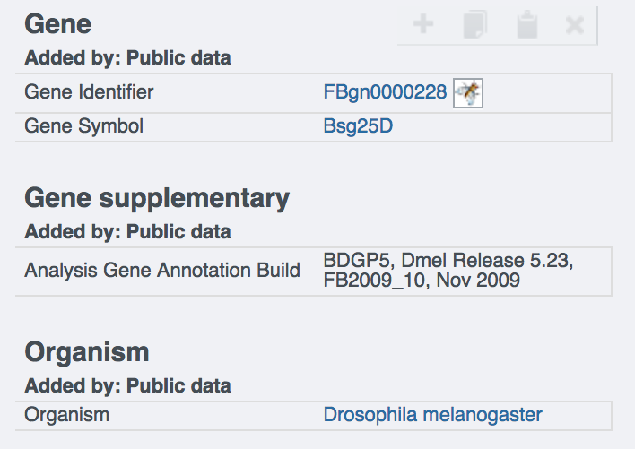 <!-- .element class="fragment" -->

  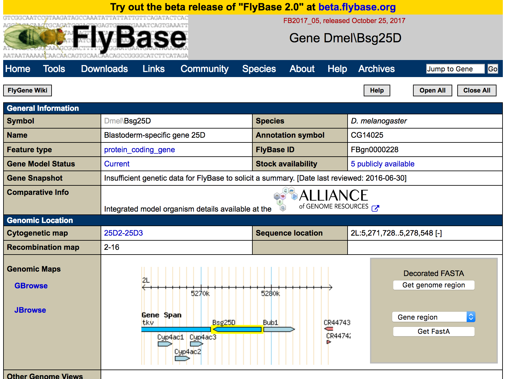 <!-- .element class="fragment" style="position: relative; top:-501px;" -->

</div>

----

<!-- .slide: data-background-image="images/idr-datasets/idr-0015-1.png" data-background-size="contain" data-background-position="top" class="fullscreen-image" -->
## Geographic HCS

<div class="fragment">
  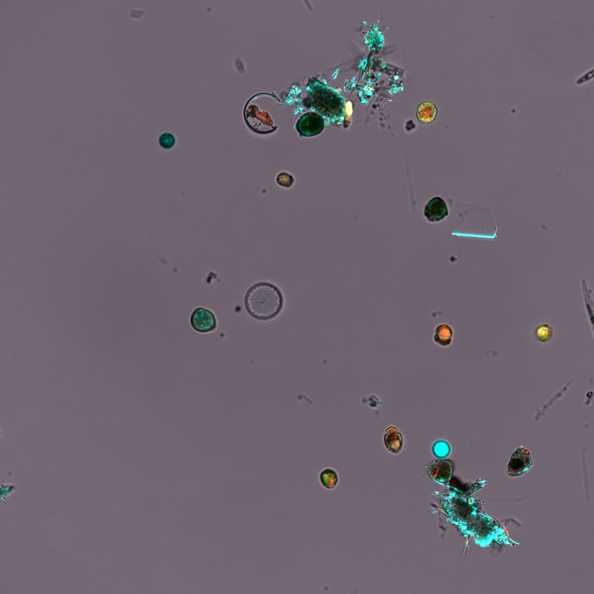 <!-- .element class="left" width="20%" -->
  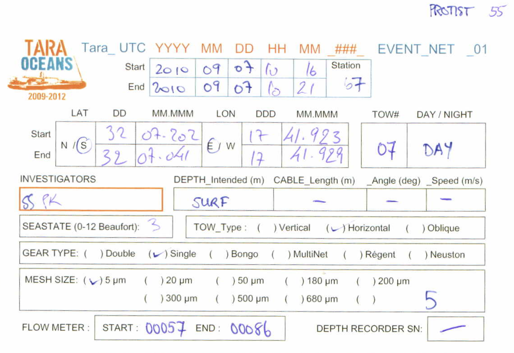 <!-- .element width="70%" -->
</div>

----

<div class="flexcontainer">

  <div class="flex1 caption">
    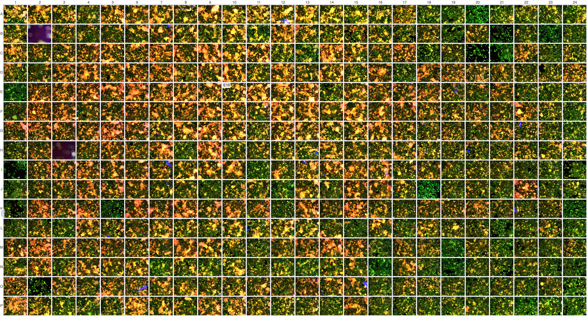 <!-- .element class="nospace" -->
    Genetic HCS
  </div>

  <div class="flex1 caption">
    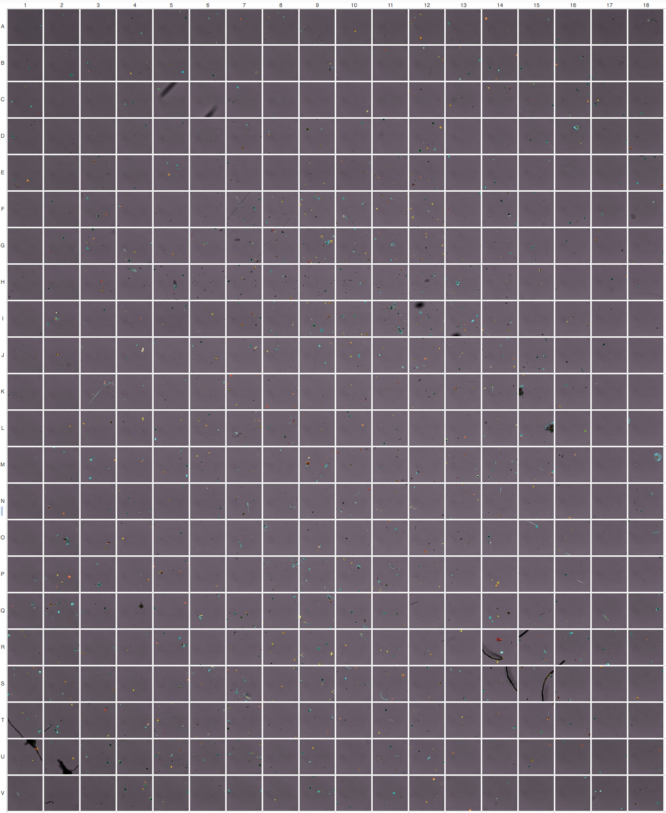 <!-- .element class="nospace" -->
    Geographic HCS
  </div>

  <div class="flex1 caption">
    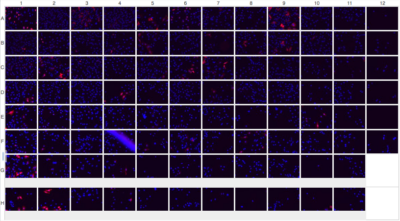 <!-- .element class="nospace" -->
    Gene product targeting HCS
  </div>

  <div class="flex1 caption">
     <!-- .element class="nospace" -->
    Chemical HCS
  </div>

</div>

<div class="flexcontainer">

  <div class="flex1 caption">
     <!-- .element width="80%" class="nospace" -->
    Histopathology
  </div>

  <div class="flex1 caption">
    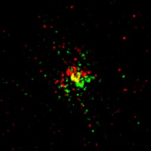 <!-- .element width="80%" class="nospace" -->
    3D&#8209;SIM
  </div>

  <div class="flex1 caption">
    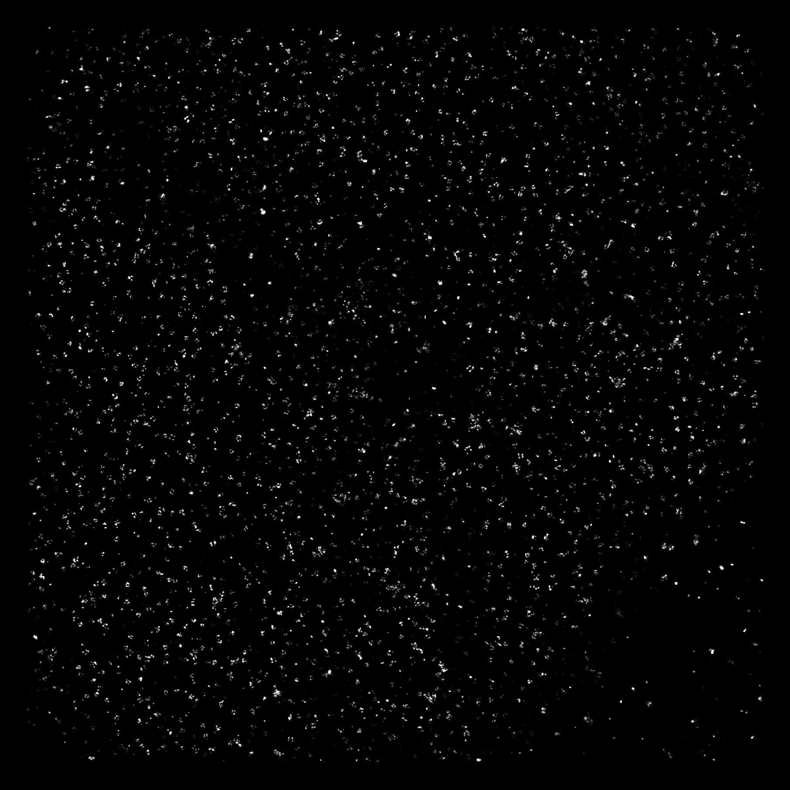 <!-- .element width="80%" class="nospace" -->
    Super-resolution
  </div>

  <div class="flex1 caption">
    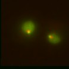 <!-- .element width="80%" class="nospace" -->
    Chromatin dynamics
  </div>

</div>

---

## Genes and phenotypes in the IDR

---

<!-- .slide: data-background-color="black" -->
<iframe src="https://idr.openmicroscopy.org/mapr/gene/?experimenter=-1" class="stretch"></iframe>

----

<!-- .slide: data-background-image="images/mapr/idr-mapr-genes-plk.png" data-background-size="contain" data-background-position="top" class="fullscreen-image" -->

----

<!-- .slide: data-background-image="images/mapr/idr-mapr-genes-plk1-1.png" data-background-size="contain" data-background-position="top" class="fullscreen-image" -->

---

<!-- .slide: class="center" -->

## How do we do this?

<div class="flexcontainer">

  <div class="flex2 fragment">
    
    <ul>
      <li>609 MB of spreadsheets</li>
      <li>334 MB of text files</li>
    </ul>
  </div>

  <div class="flex3">
     <!-- .element style="width:70%" -->
    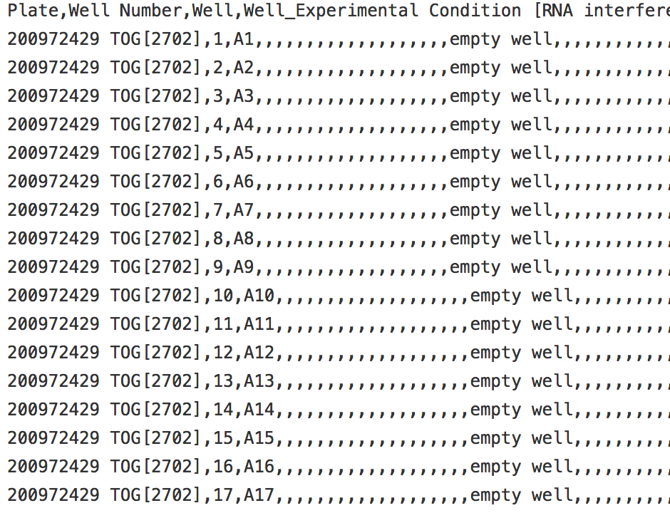 <!-- .element style="position:relative; left:10%; top:-7em; width:70%;" -->
    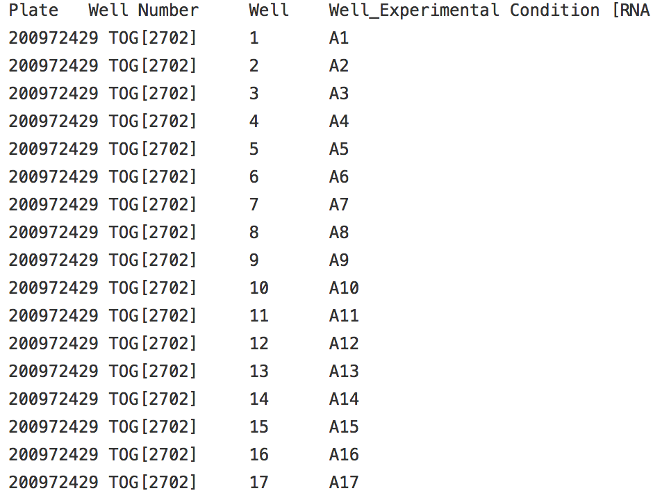 <!-- .element style="position:relative; left:20%; top:-14em; width:70%;" -->
  </div>

</div>

<!--
idr-metadata$ git log --format=oneline -1
6d4da0593c014863ee084791a4e84beaf3f45010 Merge pull request #252 from eleanorwilliams/ncbi_links
idr-metadata$ find idr00* -type f -name \*gz -exec zcat {} \; | wc -c
414357922
idr-metadata$ find idr00* -type f -name \*sv -exec cat {} \; | wc -c
224313756
idr-metadata$ find idr00* -type f -name \*txt -exec cat {} \; | wc -c
350336314
-->

---

<!-- .slide: class="center" -->
## What about *your* datasets?

----

<!-- .slide: data-background-image="images/idr-datasets/idr-0027-1.png" data-background-size="contain" data-background-position="top" class="fullscreen-image" -->
## Hi-res live cell imaging of chromatin dynamics

 <!-- .element class="fragment" width="50%" -->

----

## [nightshade.openmicroscopy.org](https://nightshade.openmicroscopy.org)

UOD Life Science's own OMERO server
- Open to everyone in SLS (and others on request)
- You can choose to publish some of your images (viewable without a login)

----

<!-- .slide: data-background-image="images/schleicher2017/omero-schleicher2017-dataset-63452.png" data-background-size="contain" data-background-position="top" class="fullscreen-image" -->

## https://omero.lifesci.dundee.ac.uk/pub/schleicher-et-al-2017
<!-- .element class="fragment" -->

## https://dx.doi.org/10.17867/10000109
<!-- .element class="fragment" -->

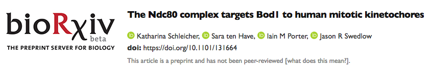
<!-- .element style="width:70%; float:right;" class="fragment" -->

 <!-- .element style="width:20%; float:left;" -->

----

<!-- .slide: data-background-image="images/schleicher2017/omero-schleicher2017-figure.png" data-background-size="contain" data-background-position="top" class="fullscreen-image" -->

## OMERO.figure

----

<!-- .slide: data-background-color="black" -->
<iframe data-src="https://omero.lifesci.dundee.ac.uk/figure/file/364215/" class="stretch"></iframe>

---

<!-- .slide: class="center" -->
## So far we have ...

- A public curated reference image repository with internal and external cross-references
- An OMERO server for publishing datasets within Dundee
- OMERO.figure, a full pipeline for creating publication quality figures

----

<!-- .slide: class="center" -->
## What's next?

Tools for analysing image data in the IDR and OMERO
- Reproducibly <!-- .element class="fragment" -->
- And shareably <!-- .element class="fragment" -->
- But why only in OMERO? And why only images? <!-- .element class="fragment" -->

---

## Analysis in the cloud
### https://idr.openmicroscopy.org/jupyter/

An online cloud-based analysis platform for running and sharing analysis scripts


 <!-- .element height="100" -->
 <!-- .element height="100" -->

----

<!-- .slide: data-background-image="images/jupyter/idr-jupyter-1.png" data-background-size="contain" data-background-position="top" class="fullscreen-image" -->

----

<!-- .slide: data-background-image="images/jupyter/idr-jupyter-2.png" data-background-size="contain" data-background-position="top" class="fullscreen-image" -->

----

<!-- .slide: data-background-image="images/jupyter/idr-jupyter-arp23complex.png" data-background-size="contain" data-background-position="top" class="fullscreen-image" -->

----

 <!-- .element class="left" width="15%" -->

## Example: searching the IDR for novel gene interactors

1. Start with a set of genes we're interested in <!-- .element class="fragment" -->
2. Obtain a phenotypic profile characterising this set of genes <!-- .element class="fragment" -->
3. Query the IDR across all studies to find other genes with a similar phenotypic profile <!-- .element class="fragment" -->
4. We now have some new potential targets to research <!-- .element class="fragment" -->
5. Initial validation with StringDB <!-- .element class="fragment" -->

----

<!-- .slide: data-background-color="black" -->
<iframe data-src="resources/ARP2-3Complex-Slide.html" class="stretch"></iframe>

----

<!-- .slide: data-background-color="black" -->
<iframe data-src="http://localhost:8888/" class="stretch"></iframe>

----

<!-- .slide: data-background-color="black" -->
<iframe data-src="http://localhost:8888/notebooks/GRE/ARP2-3Complex-Slide.ipynb" class="stretch"></iframe>


----

## Caveats

This is very preliminary work!

---

<!-- .slide: class="center" -->
## Anyone can have access to:

<div class="flexcontainer">
  <div class="flex1 caption">
    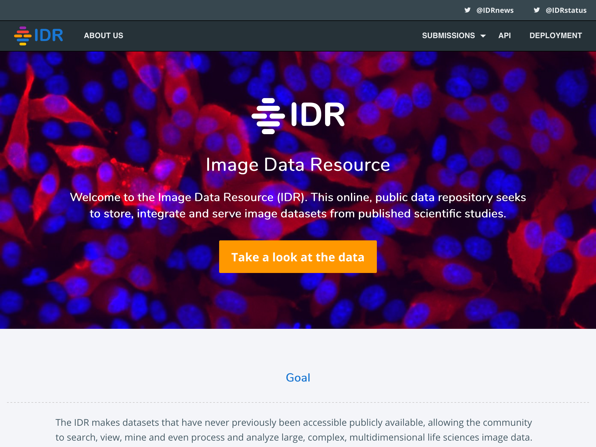 <!-- .element class="nospace" -->
    https://idr.openmicroscopy.org
  </div>
  <div class="flex1 caption">
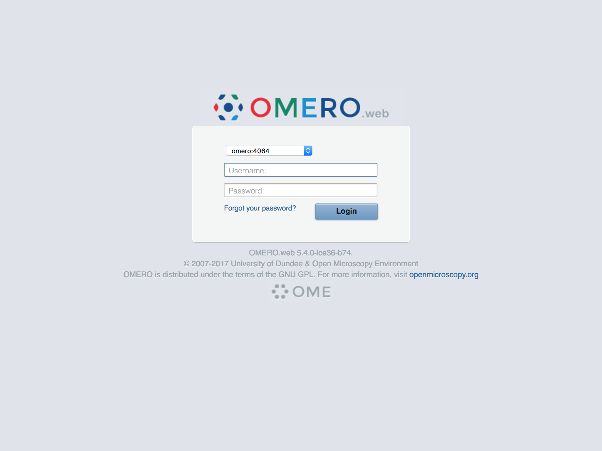 <!-- .element class="nospace" -->
    https://nightshade.openmicroscopy.org
  </div>
  <div class="flex1 caption">
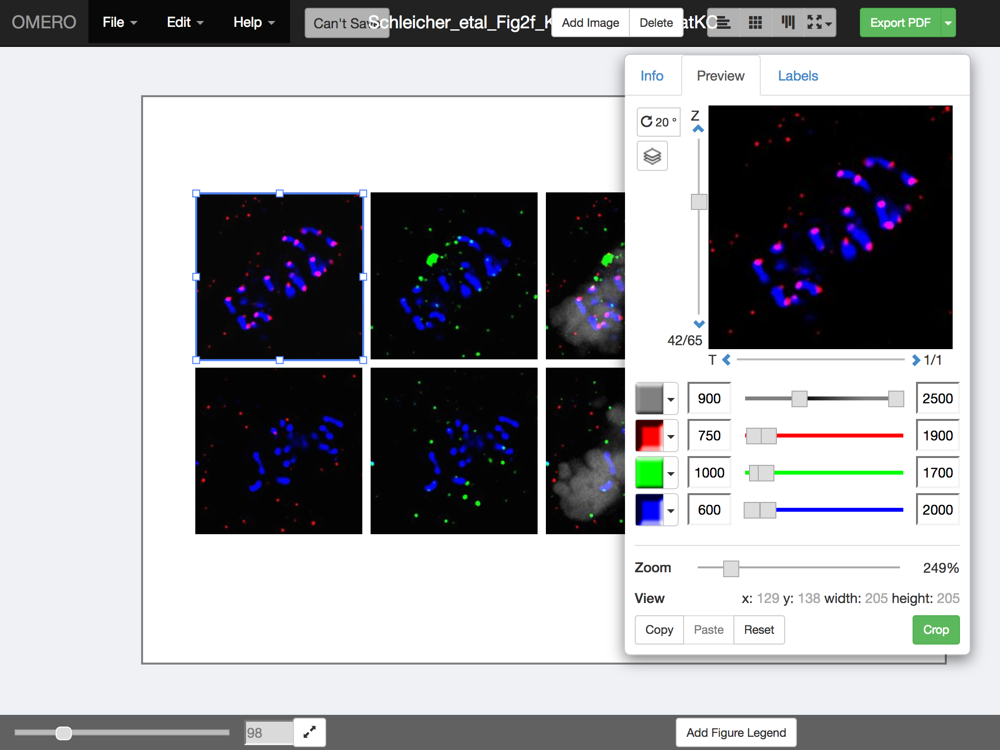 <!-- .element class="nospace" -->
    OMERO.figure
  </div>
  <div class="flex1 caption">
 <!-- .element class="nospace" -->
    Virtual analysis
  </div>
</div>

Contact us for more details: https://www.openmicroscopy.org/support/

---

<div class="idrteam">
  <div>
    
    Jason Swedlow
  </div>
  <div>
    
    Josh Moore
  </div>
  <div>
    
    Simon Li
  </div>
  <div>
    
    Eleanor Williams
  </div>
  <div>
    
    Gabriella Rustici
  </div>
  <div>
    
    Aleksandra Tarkowska
  </div>
  <div>
    
    Richard Ferguson
  </div>
  <div>
    
    Simone Leo
  </div>
  <div>
    
    David Gault
  </div>
  <div>
    
    Dominik Lindner
  </div>
  <div>
    
    Harald Waxenegger
  </div>
  <div>
    
    Helen Flynn
  </div>
  <div>
    
    Jean-Marie Burel
  </div>
  <div>
    
    June Matthew
  </div>
  <div>
    
    Kenny Gillen
  </div>
  <div>
    
    Mark Carroll
  </div>
  <div>
    
    Petr Walczysko
  </div>
  <div>
    
    Roger Leigh
  </div>
  <div>
    
    Sebastien Besson
  </div>
  <div>
    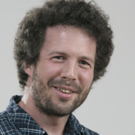
    Will Moore
  </div>
  <div style="width:160px;">
     <!-- .element class="plain whitelogo" style="height:50px;" -->
     <!-- .element class="plain whitelogo" style="height:50px" -->
  </div>
</div>

<div style="float: right;">
  <div>
     <!-- .element class="plain whitelogo" style="height: 100px;" -->
  </div>
  <div>
     <!-- .element class="plain whitelogo" style="height: 100px;" -->
  </div>
</div>

<div class="idrteam">
  <div>
    
    Alvis Brazma
  </div>
  <div>
    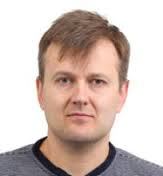
    Ugis Sarkans
  </div>
  <div>
    
    Simon Jupp
  </div>
  <div>
    
    Tony Burdett
  </div>
  <div style="width: auto;">
    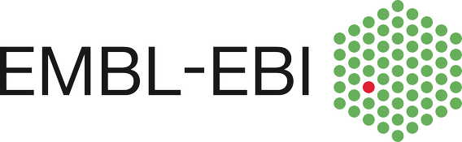 <!-- .element class="plain whitelogo" style="height: 50px;" -->
  </div>
</div>

<div class="idrteam">
  <div>
    
    Rafael Carazo-salas
  </div>
  <div style="width: auto;">
     <!-- .element class="plain whitelogo" style="height: 50px;" -->
  </div>
  <div>
    
    Bálint Antal
  </div>
  <div>
    
    Anatole Chessel
  </div>
</div>
